# Создание базы данных для интернет-магазина

## Содержание
- [Сущности и атрибуты](#сущности-и-атрибуты)
- [Концептуальная и логическая модели](#концептуальная-и-логическая-модели)
- [Описание связей](#описание-связей)
- [Нормализация базы данных](#нормализация-базы-данных)
- [Реализация базы данных](#реализация-базы-данных)
- [Тестирование и написание запросов](#тестирование-и-написание-запросов)

## Сущности и атрибуты

### Пользователь (User)
Сущность представляет клиента интернет-магазина.

| Field               | Type        | Description                                    |
|---------------------|-------------|------------------------------------------------|
| `user_id`           | INT, PK     | Уникальный идентификатор пользователя.         |
| `username`          | VARCHAR     | Имя пользователя.                              |
| `email`             | VARCHAR     | Электронная почта пользователя.                |
| `password`          | VARCHAR     | Зашифрованный пароль.                          |
| `address`           | TEXT        | Адрес доставки.                                |
| `phone_number`      | VARCHAR     | Номер телефона.                                |
| `registration_date` | TIMESTAMP   | Дата регистрации пользователя.                 |
| `is_admin`          | BOOLEAN     | Флаг, указывающий, является ли пользователь администратором. |

### Товар (Product)
Сущность представляет позицию товара, доступного для покупки.

| Field               | Type        | Description                                    |
|---------------------|-------------|------------------------------------------------|
| `product_id`        | INT, PK     | Уникальный идентификатор товара.               |
| `name`              | VARCHAR     | Название товара.                               |
| `description`       | TEXT        | Описание товара.                               |
| `price`             | DECIMAL     | Цена товара.                                   |
| `stock`             | INT         | Количество товара в наличии.                   |
| `category_id`       | INT, FK     | Ссылка на категорию товара.                    |
| `created_at`        | TIMESTAMP   | Дата добавления товара в базу.                 |
| `attributes`        | JSON        | JSON-поле для хранения дополнительных характеристик товара (например, {"color": "black", "size": "M", "warranty": "1 year"}). |

### Категория (Category)
Сущность определяет тип товаров и используется для группировки товаров по категориям.

| Field               | Type        | Description                                    |
|---------------------|-------------|------------------------------------------------|
| `category_id`       | INT, PK     | Уникальный идентификатор категории.            |
| `name`              | VARCHAR     | Название категории.                            |

### Product Category (Связующая таблица)
Связующая таблица.

| Field               | Type        | Description                                    |
|---------------------|-------------|------------------------------------------------|
| `product_id`        | INT, FK     | Ссылка на товар.                               |
| `category_id`       | INT, FK     | Ссылка на категорию товара.                    |

### Корзина (Cart)
Временное хранилище для товаров, которые пользователь добавил перед покупкой.

| Field               | Type        | Description                                    |
|---------------------|-------------|------------------------------------------------|
| `cart_id`           | INT, PK     | Уникальный идентификатор корзины.              |
| `user_id`           | INT, FK     | Ссылка на пользователя, который создал корзину.|
| `created_at`        | TIMESTAMP   | Дата создания корзины.                         |

### Элемент корзины (CartItem)
Связывающая сущность для связи товаров и корзины.

| Field               | Type        | Description                                    |
|---------------------|-------------|------------------------------------------------|
| `cart_item_id`      | INT, PK     | Уникальный идентификатор элемента корзины.     |
| `cart_id`           | INT, FK     | Ссылка на корзину.                             |
| `product_id`        | INT, FK     | Ссылка на товар.                               |
| `quantity`          | INT         | Количество выбранного товара.                  |

### Заказ (Order)
Сущность, представляющая оформленный заказ.

| Field               | Type        | Description                                    |
|---------------------|-------------|------------------------------------------------|
| `order_id`          | INT, PK     | Уникальный идентификатор заказа.               |
| `user_id`           | INT, FK     | Ссылка на пользователя, сделавшего заказ.      |
| `total_price`       | DECIMAL     | Общая стоимость заказа.                        |
| `status`            | VARCHAR     | Статус заказа (новый, в обработке, доставлен, отменён). |
| `order_date`        | TIMESTAMP   | Дата создания заказа.                          |
| `delivery_date`     | TIMESTAMP   | Дата доставки заказа.                          |

### Элемент заказа (OrderItem)
Сущность связывает товары и заказ, фиксируя состав заказа.

| Field               | Type        | Description                                    |
|---------------------|-------------|------------------------------------------------|
| `order_item_id`     | INT, PK     | Уникальный идентификатор элемента заказа.      |
| `order_id`          | INT, FK     | Ссылка на заказ.                               |
| `product_id`        | INT, FK     | Ссылка на товар.                               |
| `quantity`          | INT         | Количество товара в заказе.                    |
| `price`             | DECIMAL     | Цена товара на момент заказа.                  |


## Концептуальная и логическая модели

Для построения концептуальной модели, я воспользовался сервисом https://boardmix.com/. 
Данный сервис предоставляет большой выбор инструментов для создания различных схем и моделей. 

<p align="center">
  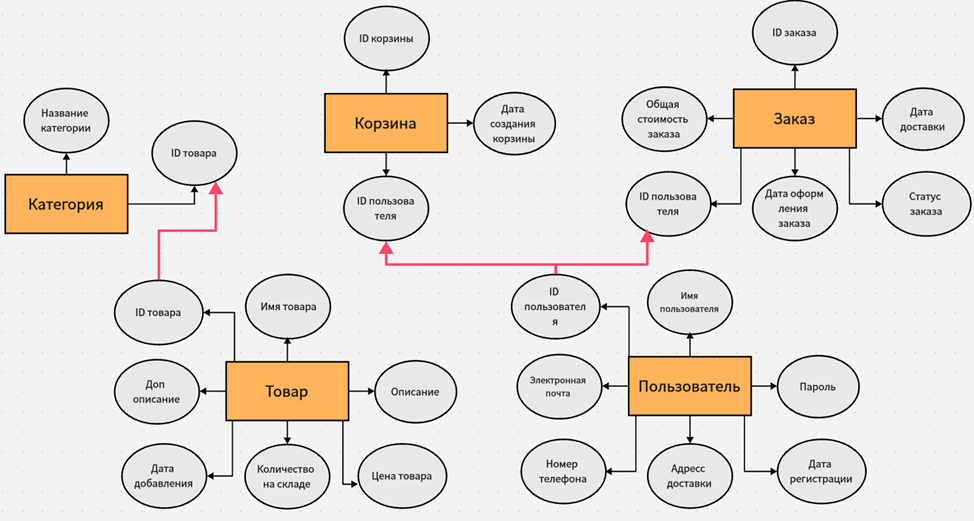
</p>

Для создания логической модели, я воспользовался сервисом https://app.database-design.ru/.
Данный сервис предоставляет широкий функционал и удобство использования при создании.

<p align="center">
  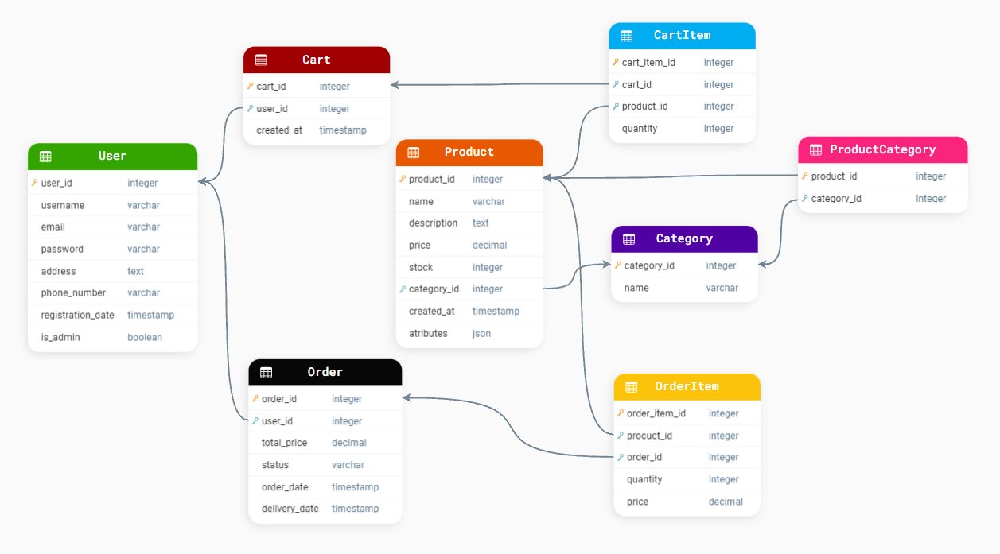
</p>


## Описание связей

### Пользователь (User) — Заказ (Order)
- **Тип связи**: один ко многим  
- **Описание**: Один пользователь может оформить несколько заказов, но каждый заказ принадлежит только одному пользователю. Это позволяет отслеживать все заказы, сделанные конкретным пользователем.

### Товар (Product) — Категория (Category)
- **Тип связи**: один ко многим  
- **Описание**: Один товар принадлежит одной категории, но в одной категории может быть несколько товаров. Это помогает организовать товары по категориям для удобства поиска и фильтрации.

### Корзина (Cart) — Элемент корзины (CartItem)
- **Тип связи**: один ко многим  
- **Описание**: Одна корзина может содержать несколько элементов (товаров), добавленных пользователем. Каждый элемент корзины связан с одним конкретным товаром и одной корзиной. Это связывает товары с корзиной для подготовки к заказу.

### Заказ (Order) — Элемент заказа (OrderItem)
- **Тип связи**: один ко многим  
- **Описание**: Один заказ может содержать несколько элементов заказа (товаров), и каждый элемент заказа связан с конкретным заказом и товаром. Это позволяет фиксировать состав каждого заказа.

### Пользователь (User) — Корзина (Cart)
- **Тип связи**: один к одному  
- **Описание**: У каждого пользователя может быть одна активная корзина, но эта корзина связана только с одним пользователем. Это гарантирует, что каждый пользователь имеет только одну корзину.

### Товар (Product) — Категория (Category)
- **Тип связи**: многие ко многим  
- **Описание**: Один товар может принадлежать нескольким категориям, а одна категория может содержать несколько товаров. Для реализации этой связи используется промежуточная таблица `ProductCategory`.

### Товар (Product) — Элемент корзины (CartItem)
- **Тип связи**: один ко многим  
- **Описание**: Один товар может быть в нескольких элементах корзины, но каждый элемент корзины ссылается на только один товар. Это реализуется через внешний ключ `product_id` в таблице `CartItem`, который ссылается на `product_id` в таблице `Product`.

### Товар (Product) — Элемент заказа (OrderItem)
- **Тип связи**: один ко многим  
- **Описание**: Один товар может быть в нескольких элементах заказа, но каждый элемент заказа ссылается на только один товар. Это реализуется через внешний ключ `product_id` в таблице `OrderItem`, который ссылается на `product_id` в таблице `Product`.


## Нормализация базы данных

Для правильной организации данных в интернет-магазине важно соблюдать нормальные формы базы данных. Это помогает устранить избыточность и предотвратить аномалии.

### Первая нормальная форма (1NF)
Требует, чтобы все атрибуты таблиц были атомарными (неделимыми). Например, в таблице "Товар" характеристики, такие как "цвет", "размер", "тип материала", должны храниться в отдельных полях или в формате JSON, а не в одном объединённом поле. Также каждое поле должно быть уникальным, например, `product_id` для товаров или `user_id` для пользователей.

### Вторая нормальная форма (2NF)
Осуществляется для устранения частичных зависимостей. Например, в таблице "Элемент заказа" составной ключ `order_id` и `product_id` требует, чтобы все атрибуты, такие как `quantity` (количество) и `price` (цена), зависели от обоих элементов ключа. Перенос зависимых атрибутов в отдельные таблицы помогает избежать избыточности.

### Третья нормальная форма (3NF)
Направлена на устранение транзитивных зависимостей. Например, если данные о пользователе, такие как адрес и телефон, хранятся в таблице "Заказ", это приводит к избыточности. Вместо этого следует хранить только ссылку на пользователя (например, `user_id`) и саму информацию о пользователе в отдельной таблице "Пользователь". Это снижает дублирование и облегчает обновление данных.


## Реализация базы данных

Выполним физическое проектирование БД. Для этого создадим два .sql скрипта для создания таблицы и добавления данных в нее

`create_table.sql`

```sql
CREATE TABLE users (
    user_id SERIAL PRIMARY KEY,
    username VARCHAR(50) NOT NULL,
    email VARCHAR(100) UNIQUE NOT NULL,
    password VARCHAR(100) NOT NULL,
    address TEXT,
    phone_number VARCHAR(15),
    registration_date TIMESTAMP DEFAULT CURRENT_TIMESTAMP,
    is_admin BOOLEAN DEFAULT FALSE
);

CREATE TABLE categories (
    category_id SERIAL PRIMARY KEY,
    name VARCHAR(50) NOT NULL
);

CREATE TABLE products (
    product_id SERIAL PRIMARY KEY,
    name VARCHAR(100) NOT NULL,
    description TEXT,
    price DECIMAL(10, 2) NOT NULL,
    stock INT DEFAULT 0,
    category_id INT REFERENCES categories(category_id) ON DELETE SET NULL,
    created_at TIMESTAMP DEFAULT CURRENT_TIMESTAMP,
    attributes JSON
);

CREATE TABLE product_category (
    product_id INT REFERENCES products(product_id) ON DELETE CASCADE,
    category_id INT REFERENCES categories(category_id) ON DELETE CASCADE,
    PRIMARY KEY (product_id, category_id)
);

CREATE TABLE carts (
    cart_id SERIAL PRIMARY KEY,
    user_id INT REFERENCES users(user_id) ON DELETE CASCADE,
    created_at TIMESTAMP DEFAULT CURRENT_TIMESTAMP
);

CREATE TABLE cart_items (
    cart_item_id SERIAL PRIMARY KEY,
    cart_id INT REFERENCES carts(cart_id) ON DELETE CASCADE,
    product_id INT REFERENCES products(product_id) ON DELETE CASCADE,
    quantity INT DEFAULT 1 CHECK (quantity > 0)
);

CREATE TABLE orders (
    order_id SERIAL PRIMARY KEY,
    user_id INT REFERENCES users(user_id) ON DELETE SET NULL,
    total_price DECIMAL(10, 2) NOT NULL CHECK (total_price >= 0),
    status VARCHAR(20) CHECK (status IN ('new', 'processing', 'shipped', 'completed', 'cancelled')),
    order_date TIMESTAMP DEFAULT CURRENT_TIMESTAMP,
    delivery_date TIMESTAMP
);

CREATE TABLE order_items (
    order_item_id SERIAL PRIMARY KEY,
    order_id INT REFERENCES orders(order_id) ON DELETE CASCADE,
    product_id INT REFERENCES products(product_id) ON DELETE SET NULL,
    quantity INT DEFAULT 1 CHECK (quantity > 0),
    price DECIMAL(10, 2) NOT NULL CHECK (price >= 0)
);
```

`data_table.sql`

```sql
-- 1. Добавление пользователей
INSERT INTO users (username, email, password, address, phone_number, is_admin)
VALUES
('marat_badamshin', 'marat_badamshin@mail.ru', 'yamarat1234', 'Moscow, Leninsky pr., 123', '+79847574574', FALSE),
('dima_bessonov', 'dima_bessonov@mail.ru', 'dimon2003228', 'Moscow, Butlerova st., 199', '+79847272535', FALSE),
('roman_abramov', 'roman_abramov@gmail.com', '_ssjd34345', 'Moscow, Nikolskaya st., 26', '+79847456789', TRUE),
('anna_ivanova', 'anna_ivanova@gmail.com', 'anna1985pass', 'Moscow, Tverskaya st., 5', '+79847654721', FALSE),
('nikita_petrov', 'nikita_petrov@mail.ru', 'nik123456', 'Moscow, Prospekt Mira, 17', '+79847653122', FALSE),
('svetlana_sokolova', 'svetlana_sokolova@yahoo.com', 'sokol_sveta', 'Moscow, Komsomolskaya st., 4', '+79847324556', FALSE),
('aleksandr_karpov', 'aleksandr_karpov@mail.ru', 'karpov777', 'Moscow, Zubovsky Blvd., 20', '+79847125487', FALSE),
('elena_kozlova', 'elena_kozlova@gmail.com', 'kozlenok92', 'Moscow, Bolshaya Yakimanka, 45', '+79847987645', FALSE),
('andrey_fedorov', 'andrey_fedorov@mail.ru', 'fedorovandr34', 'Moscow, Leningradsky pr., 55', '+79847435890', TRUE),
('irina_orlova', 'irina_orlova@gmail.com', 'orlovairina01', 'Moscow, Krasnaya Presnya st., 12', '+79847356781', FALSE),
('pavel_ivanov', 'pavel_ivanov@mail.ru', 'pavelpass123', 'Moscow, Kutuzovsky pr., 64', '+79847632145', FALSE),
('olga_belova', 'olga_belova@ya.ru', 'belova_olya', 'Moscow, Arbat st., 9', '+79847234567', FALSE),
('vladimir_egorov', 'vladimir_egorov@mail.ru', 'egorov555', 'Moscow, Varshavskoe shosse, 37', '+79847123678', FALSE);


-- 2. Добавление категорий
INSERT INTO categories (name)
VALUES
('Electronics'),      -- Для смартфонов, ноутбуков, планшетов и других электронных устройств
('Home Appliances'),  -- Для крупной бытовой техники, такой как холодильники, стиральные машины
('Accessories'),      -- Для аксессуаров, таких как наушники, умные часы
('Televisions'),      -- Для телевизоров
('Cameras'),          -- Для фото- и видеокамер
('Kitchen Appliances'); -- Для кухонной техники, такой как микроволновки, блендеры

-- 3. Добавление товаров
INSERT INTO products (name, description, price, stock, category_id, attributes)
VALUES
('Smartphone', 'Iphone 16 Pro Max 512 GB', 149990.99, 50, 1, '{"color": "black", "warranty": "1 year"}'),
('Laptop', '15-inch laptop with Intel i5 processor', 129990.99, 30, 1, '{"color": "silver", "warranty": "2 years"}'),
('Refrigerator', 'LG GC-B257JEYV', 139890.50, 10, 2, '{"color": "white", "energy_class": "A++"}'),
('Headphones', 'Sony XM4', 29990.99, 100, 3, '{"color": "black", "battery_life": "40 hours"}'),
('Smartphone', 'Samsung Galaxy S23 Ultra 256 GB', 124990.99, 40, 1, '{"color": "green", "warranty": "1 year"}'),
('Laptop', 'MacBook Air M2 13-inch 256 GB', 99990.99, 25, 1, '{"color": "space gray", "warranty": "1 year"}'),
('Refrigerator', 'Samsung RB38T676FB1', 119990.00, 15, 2, '{"color": "black", "energy_class": "A+"}'),
('Washing Machine', 'Bosch WAX32M40', 79990.99, 20, 2, '{"color": "white", "capacity": "10 kg", "energy_class": "A++"}'),
('Smartwatch', 'Apple Watch Series 9 GPS 45mm', 48990.00, 80, 3, '{"color": "starlight", "battery_life": "18 hours"}'),
('TV', 'Samsung QLED 65-inch Q70A', 89990.50, 12, 4, '{"resolution": "4K", "screen_type": "QLED"}'),
('Microwave', 'Panasonic NN-SN686S', 24990.00, 35, 2, '{"color": "stainless steel", "power": "1200W"}'),
('Camera', 'Canon EOS R6 Mark II Body', 179990.99, 5, 5, '{"sensor": "full-frame", "warranty": "2 years"}'),
('Vacuum Cleaner', 'Dyson V15 Detect', 69990.99, 40, 2, '{"type": "cordless", "battery_life": "60 minutes"}'),
('Air Conditioner', 'Daikin FTXB35C', 45990.99, 10, 2, '{"cooling_capacity": "12000 BTU", "energy_class": "A"}'),
('Tablet', 'iPad Pro 12.9-inch 128 GB', 119990.99, 30, 1, '{"color": "silver", "warranty": "1 year"}'),
('Blender', 'Philips HR3655', 8990.00, 50, 2, '{"power": "1400W", "capacity": "2 L"}');

-- 4. Связь товаров и категорий
INSERT INTO product_category (product_id, category_id)
VALUES
(1, 1),  -- Smartphone (Iphone 16 Pro Max) in Electronics
(2, 1),  -- Laptop (15-inch with Intel i5) in Electronics
(3, 2),  -- Refrigerator (LG GC-B257JEYV) in Home Appliances
(4, 3),  -- Headphones (Sony XM4) in Accessories
(5, 1),  -- Smartphone (Samsung Galaxy S23 Ultra) in Electronics
(6, 1),  -- Laptop (MacBook Air M2) in Electronics
(7, 2),  -- Refrigerator (Samsung RB38T676FB1) in Home Appliances
(8, 2),  -- Washing Machine (Bosch WAX32M40) in Home Appliances
(9, 3),  -- Smartwatch (Apple Watch Series 9) in Accessories
(10, 4), -- TV (Samsung QLED 65-inch Q70A) in Televisions
(11, 6), -- Microwave (Panasonic NN-SN686S) in Kitchen Appliances
(12, 5), -- Camera (Canon EOS R6 Mark II) in Cameras
(13, 2), -- Vacuum Cleaner (Dyson V15 Detect) in Home Appliances
(14, 2), -- Air Conditioner (Daikin FTXB35C) in Home Appliances
(15, 1), -- Tablet (iPad Pro 12.9-inch) in Electronics
(16, 6); -- Blender (Philips HR3655) in Kitchen Appliances


-- 5. Добавление корзин
INSERT INTO carts (user_id)
VALUES
(1),  -- marat_badamshin cart
(3),  -- roman_abramov cart
(4),  -- anna_ivanova cart
(5),  -- nikita_petrov cart
(6),  -- svetlana_sokolova cart
(7),  -- aleksandr_karpov cart
(8),  -- elena_kozlova cart
(9),  -- andrey_fedorov cart
(10), -- irina_orlova cart
(11), -- pavel_ivanov cart
(12), -- olga_belova cart
(13); -- vladimir_egorov cart


-- 6. Добавление элементов корзины
INSERT INTO cart_items (cart_id, product_id, quantity)
VALUES
(1, 1, 2),    -- 2 Smartphones in marat_badamshin cart
(1, 4, 1),    -- 1 Headphones in marat_badamshin cart
(1, 6, 1),    -- 1 MacBook Air M2 in marat_badamshin cart

(2, 2, 1),    -- 1 Laptop in roman_abramov cart
(2, 9, 2),    -- 2 Apple Watches in roman_abramov cart

(3, 5, 1),    -- 1 Samsung Galaxy S23 Ultra in anna_ivanova cart
(3, 7, 1),    -- 1 Samsung Refrigerator in anna_ivanova cart

(4, 6, 1),    -- 1 MacBook Air M2 in nikita_petrov cart
(4, 11, 1),   -- 1 Panasonic Microwave in nikita_petrov cart
(4, 15, 2),   -- 2 iPad Pro in nikita_petrov cart

(5, 9, 2),    -- 2 Apple Watch Series 9 in svetlana_sokolova cart
(5, 13, 1),   -- 1 Dyson Vacuum Cleaner in svetlana_sokolova cart

(6, 7, 1),    -- 1 Samsung Refrigerator in aleksandr_karpov cart
(6, 10, 1),   -- 1 Samsung QLED TV in aleksandr_karpov cart
(6, 12, 1),   -- 1 Canon EOS R6 Camera in aleksandr_karpov cart

(7, 10, 1),   -- 1 Samsung QLED TV in elena_kozlova cart
(7, 13, 2),   -- 2 Dyson Vacuum Cleaners in elena_kozlova cart

(8, 12, 1),   -- 1 Canon EOS R6 Camera in andrey_fedorov cart
(8, 16, 1),   -- 1 Philips Blender in andrey_fedorov cart

(9, 13, 1),   -- 1 Dyson Vacuum Cleaner in irina_orlova cart
(9, 11, 2),   -- 2 Panasonic Microwaves in irina_orlova cart

(10, 15, 1),  -- 1 iPad Pro in pavel_ivanov cart
(10, 4, 1),   -- 1 Sony Headphones in pavel_ivanov cart
(10, 8, 1),   -- 1 Bosch Washing Machine in pavel_ivanov cart

(11, 11, 1),  -- 1 Panasonic Microwave in olga_belova cart
(11, 16, 2),  -- 2 Philips Blenders in olga_belova cart

(12, 16, 1),  -- 1 Philips Blender in vladimir_egorov cart
(12, 5, 1),   -- 1 Samsung Galaxy S23 Ultra in vladimir_egorov cart
(12, 10, 1);  -- 1 Samsung QLED TV in vladimir_egorov cart


-- 7. Добавление заказов
INSERT INTO orders (user_id, total_price, status, order_date, delivery_date)
VALUES
(1, 329972.97, 'new', NOW(), NULL),  -- Order by marat_badamshin
(3, 129990.99, 'shipped', NOW() - INTERVAL '5 days', NOW() + INTERVAL '2 days'),  -- Order by roman_abramov
(4, 89990.99, 'completed', NOW() - INTERVAL '15 days', NOW() - INTERVAL '10 days'),  -- Order by anna_ivanova
(5, 258990.99, 'cancelled', NOW() - INTERVAL '8 days', NULL),  -- Order by nikita_petrov
(6, 159980.99, 'new', NOW(), NULL),  -- Order by svetlana_sokolova
(7, 197890.50, 'shipped', NOW() - INTERVAL '3 days', NOW() + INTERVAL '4 days'),  -- Order by aleksandr_karpov
(8, 205990.99, 'completed', NOW() - INTERVAL '20 days', NOW() - INTERVAL '15 days'),  -- Order by elena_kozlova
(9, 89990.50, 'new', NOW(), NULL),  -- Order by andrey_fedorov
(10, 229990.99, 'completed', NOW() - INTERVAL '25 days', NOW() - INTERVAL '20 days'),  -- Order by irina_orlova
(11, 309890.99, 'shipped', NOW() - INTERVAL '1 day', NOW() + INTERVAL '3 days'),  -- Order by pavel_ivanov
(12, 119980.50, 'new', NOW(), NULL),  -- Order by olga_belova
(13, 389980.99, 'processing', NOW() - INTERVAL '2 days', NULL);  -- Order by vladimir_egorov


-- 8. Добавление элементов заказов
INSERT INTO order_items (order_id, product_id, quantity, price)
VALUES
(1, 1, 2, 149990.99),    -- 2 Smartphones in marat_badamshin order
(1, 4, 1, 29990.99),     -- 1 Headphones in marat_badamshin order

(2, 2, 1, 129990.99),    -- 1 Laptop in roman_abramov order

(3, 5, 1, 99990.99),     -- 1 Samsung Galaxy S23 Ultra in anna_ivanova order
(3, 7, 1, 39990.00),     -- 1 Samsung Refrigerator in anna_ivanova order

(4, 6, 1, 129990.99),    -- 1 MacBook Air M2 in nikita_petrov order
(4, 9, 1, 29990.99),     -- 1 Apple Watch in nikita_petrov order
(4, 8, 1, 48990.99),     -- 1 Bosch Washing Machine in nikita_petrov order

(5, 9, 2, 29990.99),     -- 2 Apple Watches in svetlana_sokolova order
(5, 13, 1, 45990.99),    -- 1 Dyson Vacuum Cleaner in svetlana_sokolova order

(6, 7, 1, 39990.99),     -- 1 Samsung Refrigerator in aleksandr_karpov order
(6, 10, 1, 119990.99),   -- 1 Samsung QLED TV in aleksandr_karpov order
(6, 12, 1, 109990.99),   -- 1 Canon Camera in aleksandr_karpov order

(7, 10, 1, 119990.99),   -- 1 Samsung QLED TV in elena_kozlova order
(7, 13, 2, 45990.99),    -- 2 Dyson Vacuum Cleaners in elena_kozlova order

(8, 12, 1, 109990.99),   -- 1 Canon Camera in andrey_fedorov order
(8, 16, 1, 5990.99),     -- 1 Philips Blender in andrey_fedorov order

(9, 13, 1, 45990.99),    -- 1 Dyson Vacuum Cleaner in irina_orlova order
(9, 11, 2, 15990.99),    -- 2 Panasonic Microwaves in irina_orlova order

(10, 15, 1, 99990.99),   -- 1 iPad Pro in pavel_ivanov order
(10, 4, 1, 29990.99),    -- 1 Sony Headphones in pavel_ivanov order
(10, 8, 1, 48990.99),    -- 1 Bosch Washing Machine in pavel_ivanov order

(11, 11, 1, 15990.99),   -- 1 Panasonic Microwave in olga_belova order
(11, 16, 2, 5990.99),    -- 2 Philips Blenders in olga_belova order

(12, 16, 1, 5990.99),    -- 1 Philips Blender in vladimir_egorov order
(12, 5, 1, 99990.99),    -- 1 Samsung Galaxy S23 Ultra in vladimir_egorov order
(12, 10, 1, 119990.99);  -- 1 Samsung QLED TV in vladimir_egorov order
```

Выполним скрипт на создание и добавление данных в таблицы:
<p align="center">
  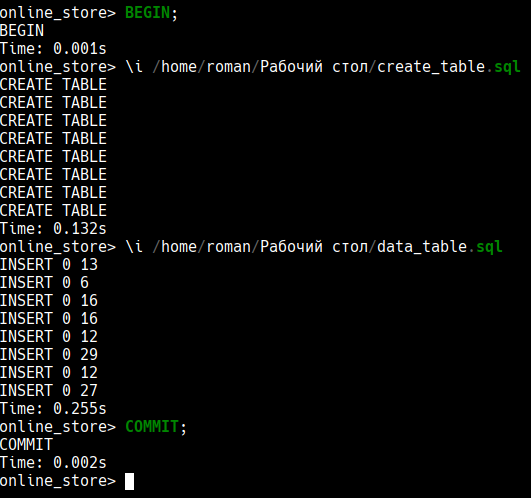
</p>


## Тестирование и написание запросов

### Запрос для поиска пользователей, которые совершали покупки на сумму выше средней стоимости заказа:
<p align="center">
  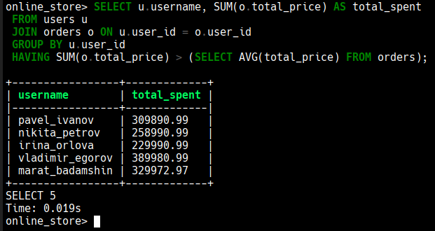
</p>

### Запрос для получения списка пользователей и общего количества заказов по каждому пользователю, которые были выполнены за последние 30 дней:
<p align="center">
  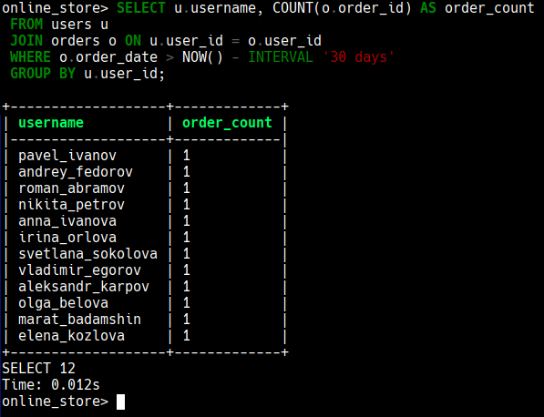
</p>

### Получим товары, которые продаются в количестве выше среднего в заказах:
<p align="center">
  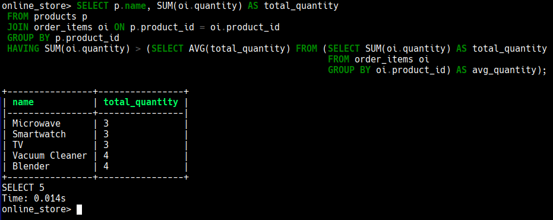
</p>

### Найдем всех пользователей, которые заказывали товары с различными ID:
<p align="center">
  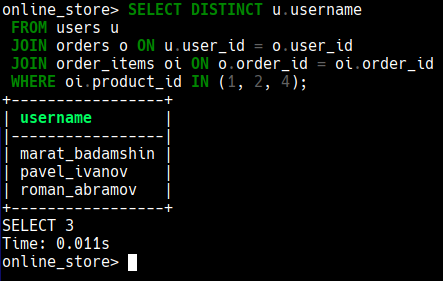
</p>

### Определим ранг пользователей, чтобы выявить топ-покупателя:
<p align="center">
  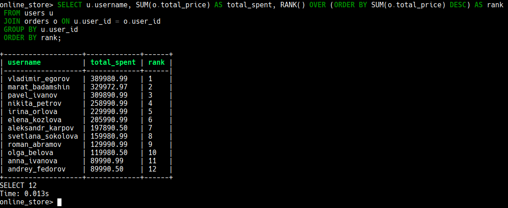
</p>

### Выведем список пользователей, у которых общая сумма всех заказов превышает определенный лимит: 
<p align="center">
  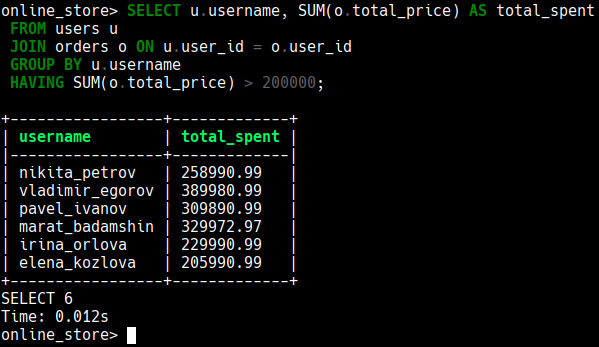
</p>

### Выведем количество заказов по статусам:
<p align="center">
  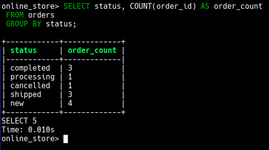
</p>

### Выведем продукты, которые чаще всего добавлялись в корзину:
<p align="center">
  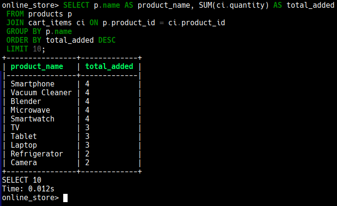
</p>
